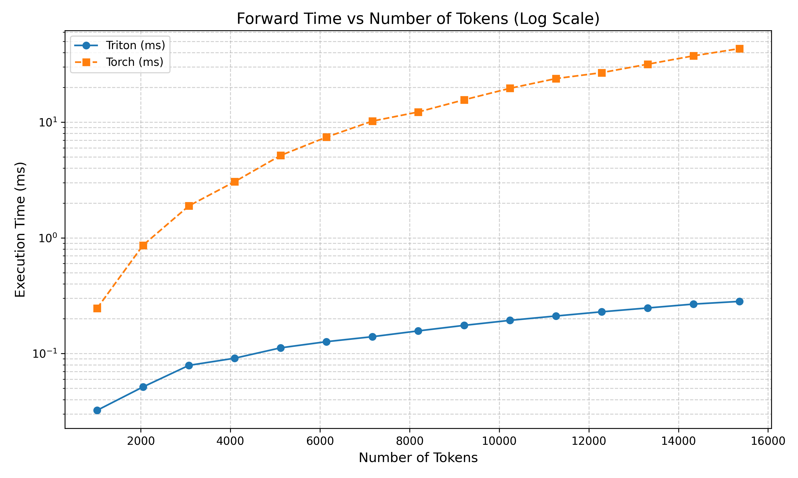
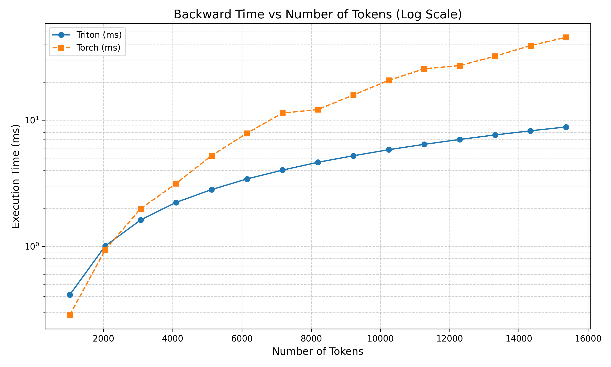

# Flash-Attention-Triton-kernel-Bloc-Sliding-Window
A Triton implementation of flash attention with a sliding window block attention pattern (SWBA). Very useful for processing videos with a transformer in an autoregressive manner.


## Attention pattern

The attention pattern is defined by two parameters : the bloc size (ex : the number of tokens per frames) and the window size (the contexte size).


<div style="text-align: center;">
  
</div>


## Performance vs torch implementation (FP16 A100 SXM)

Average performance with :

```python
batch_size = 1
num_head = 12
window_size = 16
bloc_size = 256
```

<div style="display: flex; justify-content: space-around;">
  
  
</div>


## Usage

This kernel is designed for fp16 precision.
The bloc size need to be divisible by 64 and 128 (You can modify BLOC_M and BLOC_N parameters to avoid this constraint).
Also the number of tokens need to be divisible by bloc size.

```python
import torch
from kernel.SWBA import attention

B = 4 # batch size
NH = 12  # num heads
N = 4096 # num tokens 
DH = 64 # head dim

BS = 256 # bloc size
WS = 4 # window size

# BS % BLOCK_M == 128/64 and BS % BLOCK_N == 128/64
assert BS % 128 == 0 
assert BS % 64 == 0
assert N % BS == 0 

sm_scale = 1/(D_HEAD**0.5)

q = torch.randn((B,NH,N,DH), dtype = torch.float16).cuda().requires_grad_()
k = torch.randn((B,NH,N,DH), dtype = torch.float16).cuda().requires_grad_()
v = torch.randn((B,NH,N,DH), dtype = torch.float16).cuda().requires_grad_()

do = torch.randn_like(q)

out = attention(q, k, v, BS, WS, sm_scale) # forward

out.backward(do) # backward
```


## Naive torch implementation :

Ineficient torch implementation :

```python
def SBA(q, k, v, bs, ws, sm_scale):
    
    # q,k,v : [B, NH, N, DH]

    B, NH, N, DH = q.size()
    NB = N//bs

    mask = torch.triu(torch.ones((NB,NB), device=q.device), diagonal=1) + torch.tril(torch.ones((NB,NB), device=q.device), diagonal=-ws)
    mask = torch.masked_fill(mask, mask == 1.0, float('-inf'))
    mask = mask.repeat_interleave(bs,0)
    mask = mask.repeat_interleave(bs,1)
    mask = mask.unsqueeze(0).unsqueeze(0) # [1,1,N,N]

    attn = (q @ k.transpose(-2, -1)) * sm_scale # [B, NH, N, N]
    attn = attn + mask.to(attn.dtype)
    attn = attn.softmax(dim=-1)

    out = attn @ v

    return out
```


