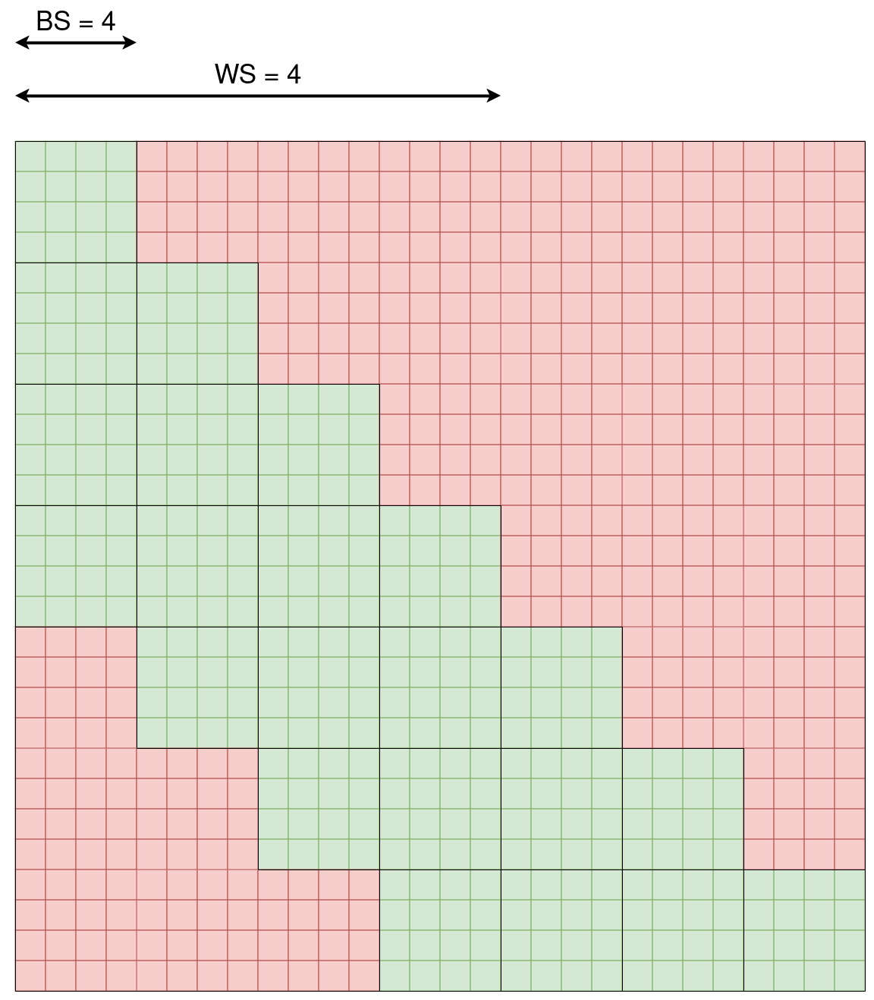

# Flash-Attention-Triton-kernel-Bloc-Sliding-Window
A Triton implementation of flash attention with a sliding window block attention pattern (SWBA). Very useful for processing videos with a transformer in an autoregressive manner.

## Attention pattern

This kernel is defined by two parameters : the bloc size (ex : the number of tokens per frames) and the window size (the contexte size).

  

## Performance vs torch implementation

